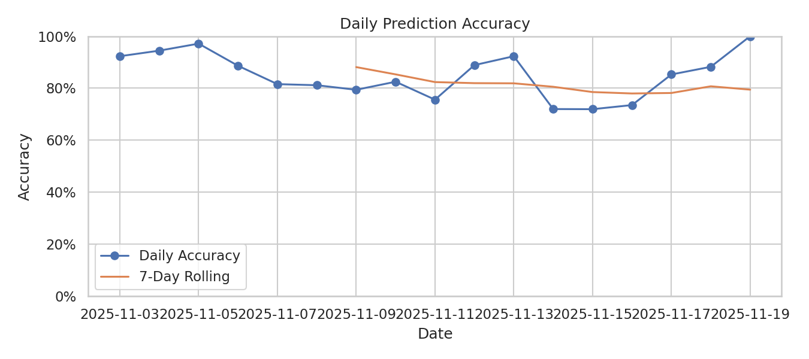
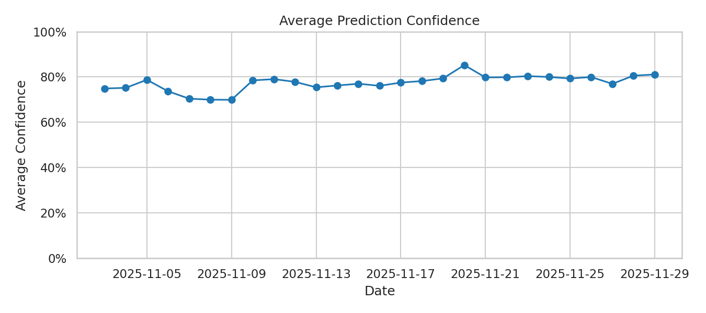

# 📊 Model Performance Dashboard

_Generated: 2025-11-22 15:24 CST_

## Overview

- **Overall Accuracy**: 83.71% (848/1013)
- **7-Day Rolling Accuracy**: 79.53%
- **Most Recent Day**: 2025-11-21 — accuracy 85.71% on 14 games
- **Average Confidence (latest day)**: 79.79%

## Daily Accuracy

## Average Confidence

### Recent History

| Date | Games | Correct | Accuracy | Avg Confidence |
|------|-------|---------|----------|----------------|
| 2025-11-12 | 54 | 48 | 88.89% | 77.83% |
| 2025-11-13 | 26 | 24 | 92.31% | 75.43% |
| 2025-11-14 | 50 | 36 | 72.00% | 76.23% |
| 2025-11-15 | 82 | 59 | 71.95% | 77.00% |
| 2025-11-16 | 34 | 25 | 73.53% | 76.09% |
| 2025-11-17 | 34 | 29 | 85.29% | 77.51% |
| 2025-11-18 | 68 | 60 | 88.24% | 78.18% |
| 2025-11-19 | 56 | 42 | 75.00% | 79.35% |
| 2025-11-20 | 10 | 10 | 100.00% | 85.23% |
| 2025-11-21 | 14 | 12 | 85.71% | 79.79% |

## Drift Snapshot

Latest drift snapshot (Season 2025-26, 774 games): accuracy 0.753, logloss 0.580, brier 0.195.

## Performance Trends

- **Last 7 Days**: 79.53% (237/298 games)
- **Trend**: ⬇️ Recent performance is 4.18% below overall average

---

📈 [Back to Main README](README.md) | 🎯 [View Latest Predictions](predictions.md)
